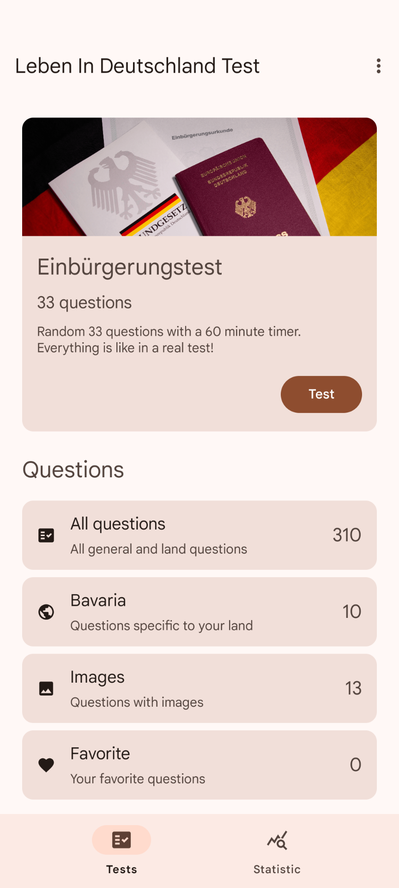

#

# Leben In Deutschland Test

### Android application for preparing for the "Einbürgerungstest" in Germany

### Features

- Real test simulation
- Topics and subjects
- Statistics
- Choice of country of residence
- Translation into native language
- Favorites
- No internet connection (except for translation)
- Material 3
- AMOLED

### Screenshots

  
  
  
  

